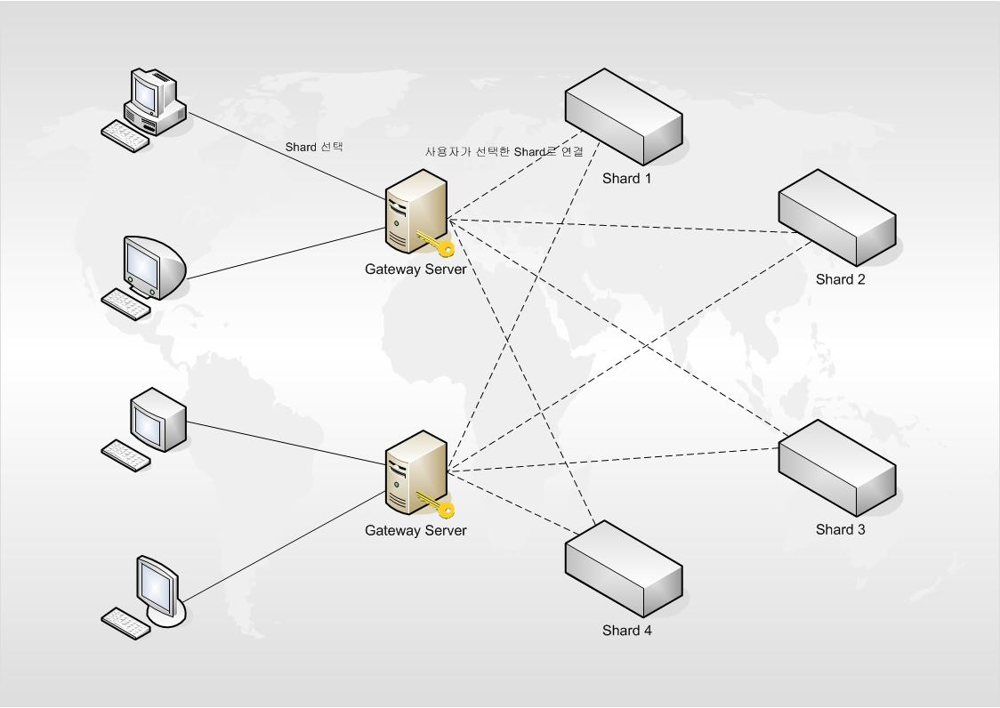

# ServerFrameWork

게임 서버 개발 실무 경험을 바탕으로 설계한 C++ 기반 MMO 서버 프레임워크입니다.  
IOCP 기반 비동기 네트워크 처리, 멀티스레드 아키텍처, 유저 세션 관리, 샤드 및 월드 시스템 등 대규모 온라인 게임 운영에 필요한 핵심 요소를 구조화하였습니다.

본 프로젝트는 단순한 기능 구현에 그치지 않고, **개발 생산성과 안정성, 운영 효율을 모두 고려한 구조 설계**를 목표로 하였습니다.

---

## 🎯 목적 및 방향성

- **실전 운영 경험에 기반한 구조 설계**
- **팀원들이 빠르게 개발에 착수할 수 있는 공통 프레임 제공**
- **반복 작업 최소화 및 디버깅/운영 편의성 강화**
- **PM 역할을 겸한 개발자로서, 협업과 유지보수까지 고려한 설계**

---

## 🏗️ 주요 아키텍처

| 모듈 | 설명 |
|------|------|
| `Gateway` | 클라이언트 최초 접속 처리 및 인증 관리 |
| `Login` | 계정 인증, 로그인 큐 관리 |
| `Shard` | 지역/채널 단위 분산 처리. 세션 라우팅 포함 |
| `World` | 유저 상태 관리 및 월드 이벤트 처리 |
| `Character` | 캐릭터 로딩 및 저장, 상태 갱신 |
| `Supervisor` | 전체 서버 상태 모니터링 및 제어 인터페이스 제공 |

**아키텍처 시각 자료**는 `/docs/` 폴더 및 아래 이미지 참조:

- 

---

## ⚙️ 기술 스택

- **Language**: C++
- **Concurrency**: IOCP, Thread Pool
- **Memory Management**: Memory Pool 기반 객체 관리
- **Protocol**: 커스텀 바이너리 프로토콜 + ID 기반 메시지 핸들러
- **Tooling**: Visual Studio, WinDbg, CRT Debug Heap
- **DevOps 시도**: NPC 스크립트 자동화, 배포 스크립트, 테스트 로그 기반 진단 등

---

## 🔍 향후 확장 고려사항

- 로그 기반 이상 탐지 기능
- AI를 활용한 서버 이벤트 예측 및 자동 리커버리 실험
- ChatGPT 기반 NPC 다이얼로그 생성 PoC

---

# C++ ServerFrameWork
### IOCP 서버 C++ 프레임워크
# 서버의 구조

